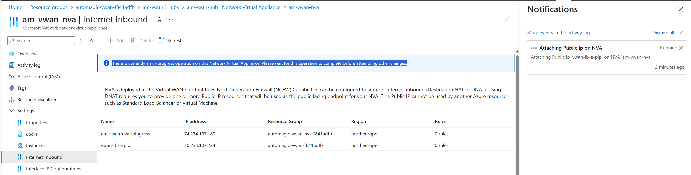

# Azure vWAN lab

* get admin credentials in [Azure Shell](https://shell.azure.com/)

```bash
### IN AZURE SHELL ###
# check the script before running
curl -sL https://run.klaud.online/make-sp.sh
# create credentials
source <(curl -sL https://run.klaud.online/make-sp.sh)
# it produced JSON to be placed to secrets/sp.json
```

* back in Codespace/DevContainer - login with admin SP using 
```bash
make sp-login
``` 
after checking that `./secrets/sp.json` is present with 
```bash
cat ./secrets/sp.json | jq .
```

* get reader SP in [Azure Shell](https://shell.azure.com/) using
```bash
az ad sp create-for-rbac --name "automagic-reader-$(openssl rand -hex 4)" --role Reader --scopes "/subscriptions/$(az account show --query id --output tsv)" | tee reader.json
```

* back in Codespace/DevContainer - check reader SP using 
```bash
make reader-check
``` 
after checking that `./secrets/reader.json` is present with 
```bash
cat ./secrets/reader.json | jq .
```

* login with full SP again with
```bash
make sp-login
```

* create new Security Management with policy etc. using; it takes approximately 20 minutes
```bash
time make cpman
```
* create new vWAN with CloudGuard NVAs using; this does not include spokes (satelitte VNETS) yet and takes about 30 minutes and you can run it in paralell to Management creation above
```bash
time make vwan-up
```

* once both Management and vWAN are created, you can create satelitte VNETs (spokes) using; This includes 2 VNETs with Linux VMs running `nginx` web server and WAF deployment into `spoke77`. This takes about 20-30 minutes.
```bash
time make vwan-spokes-up
```

* you can reach spoke machines using commands:
```bash
# first spoke (10.77.1.4)
make linux77-ssh
# other spoke Linux (10.68.1.4)
make linux68-ssh
```

* we will also create additional Public IPs for vWAN ELB to use in addition to the 1 Public IP created by default with vWAN deployment. This is needed for example if you want to expose multiple services via ELB on standard ports - e.g. two web servers on port 80/443. This takes about 10 minutes.

```bash
time make vwan-pip-up
# referesh policy with new objects of Public IPs
time make policy-up
```

* once IPs are created, they need to be associated to ELB using Azure Portal under vHub's NVA Inbound Setings:

  - Go to Azure Portal -> Resource Groups -> select the resource group where vWAN is deployed (e.g. `automagic-vwan-xxxxxx`)
  - Select the vHub resource (e.g. `am-vwan`)
  - Under "Connectivity" / "Hubs" select hub `am-vwan-hub`
  - "Third Party Providers" / "Network Virtual Appliance" select `am-vwan-nva` (or your NVA name)
  - Select "Manage Configurations"
  - Select "Settings" / "Internet Inbound"
  - There is list of ELB IPs and associated inbound rules
  - If NVA managed application allows (is  ot updating state), you can add additional Public IPs to the list of ELB IPs
  - Select "Add" for RG `automagic-vwan-xxxxxx` and Public IPs `vwan-lb-a-pip` and `vwan-lb-b-pip` (or your names)
  - Save the configuration
  - It is done one by one and you need to wait for NVA managed app state to be in finished stated. Follow notification area and status above list of IPs in configuration screen.
  - Add IP button is not active when state says "There is currently an in-progress operation on this Network Virtual Appliance. Please wait for this operation to complete before attempting other changes."



* then check IP assignments using
```bash
make vwan-lbips
# similar command exists for inbound rules
make vwan-lbrules
# returns "null" until rule is assigned
```

* login to SmartConsoler R82 using IP and credentials provided in the output of `make cpman-pass` 

* Now we may enable CME to find and provision vWAN CloudGuard CGNS NVAs. This is scripted with
```bash
make vwan-cme-up
```
* Neccesary inputs were collected and CME was enabled using CME API calls to service on Security Management.
* NVA gateway objects will appear in Security Management automatically and policy package `vmss` is pushed to them.

* update NVA LB Inbound rules
```bash
make vwan-lbrules-set
# retry later, if "InboundSecurityRule am-vwan-nva can not be updated because Parent Nva am-vwan-nva is Updating." or simolar situation (e.g. because you assigned new Public IPs recently and update is still in progress)
# check
make vwan-lbrules
# update policy (and install manually in SmartConsole)
```

* This is how you set N-S and E-W routing intent to involve CloudGuard in traffic inspection:
```bash
make vwan-fwstate
# not found in case not enabled
# enable
make vwan-fwon
# would remove fw from path using
# make vwan-fwoff

# check state aggain, once ON
make vwan-fwstate
```